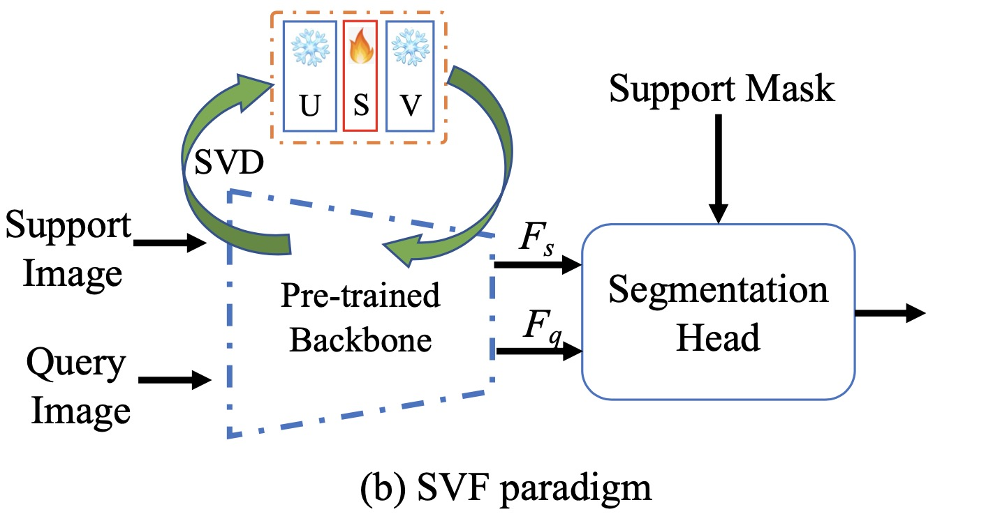

# SVF-pytorch

This is the official pytorch implementation of [Singular Value Fine-tuning: Few-shot Segmentation requires Few-parameters Fine-tuning](https://arxiv.org/pdf/2206.06122.pdf) in NeurIPS 2022.

Authors: Yanpeng Sun^, Qiang Chen^, Xiangyu He^, Jian Wang, Haocheng Feng, Junyu Han, Errui Ding, Jian Cheng, [Zechao Li](https://zechao-li.github.io/), Jingdong Wang

<div align="center">
<br/>
</div>


## Usage

This tool can not only decompose and rebuild the model, but also decompose and rebuild a layer individually.

```python
from . import svf
import torchvision.models as models

model = models.resnet18(pretrained=True)
model = svf.resolver(model,
                     global_low_rank_ratio=1.0,  # no need to change
                     skip_1x1=False,  # we will decompose 1x1 conv layers
                     skip_3x3=False  # we will decompose 3x3 conv layers
                                   )
```


## Pipeline:

We use a full-rank model as an input, then factorize the original model and return a low-rank model.

- Previous Convolution Layer

```python
conv = nn.Conv2d(in_channels, out_channels, kernel_size, stride, padding, dilation, groups, bias)
```

- Replaced by

```python
class SVD_Conv2d(nn.Lyaer):
    """Kernel Number first SVD Conv2d
    """

    def __init__(self, in_channels, out_channels, kernel_size,
                 stride, padding, dilation, groups, bias,
                 padding_mode='zeros', device=None, dtype=None,
                 rank=1):
        super(SVD_Conv2d, self).__init__()
        factory_kwargs = {'device': device, 'dtype': dtype}
        self.conv_U = nn.Conv2d(rank, out_channels, (1, 1), (1, 1), 0, (1, 1), 1, bias)
        self.conv_V = nn.Conv2d(in_channels, rank, kernel_size, stride, padding, dilation, groups, False)
        self.vector_S = nn.Parameter(torch.empty((1, rank, 1, 1), **factory_kwargs))

    def forward(self, x):
        x = self.conv_V(x)
        x = x.mul(self.vector_S)
        output = self.conv_U(x)
        return output

```
## Usage in FSS model:
First, decompose and rebuild all layers in the backbone.

```python
if args.svf:
    self.layer0 = svf.resolver(self.layer0, global_low_rank_ratio=1.0, skip_1x1=False, skip_3x3=False)
    self.layer1 = svf.resolver(self.layer1, global_low_rank_ratio=1.0, skip_1x1=False, skip_3x3=False)
    self.layer2 = svf.resolver(self.layer2, global_low_rank_ratio=1.0, skip_1x1=False, skip_3x3=False)
    self.layer3 = svf.resolver(self.layer3, global_low_rank_ratio=1.0, skip_1x1=False, skip_3x3=False)
    self.layer4 = svf.resolver(self.layer4, global_low_rank_ratio=1.0, skip_1x1=False, skip_3x3=False)
```
Then, set up the new model freezing strategy.
```python
def svf_modules(self, model):
   for param in model.layer0.parameters():
        param.requires_grad = False
   for param in model.layer1.parameters():
        param.requires_grad = False
   for name, param in model.layer2.named_parameters():
        param.requires_grad = False
        if 'vector_S' in name:
           param.requires_grad = True 
   for name, param in model.layer3.named_parameters():
        param.requires_grad = False
        if 'vector_S' in name:
           param.requires_grad = True 
   for name, param in model.layer4.named_parameters():
        param.requires_grad = False
        if 'vector_S' in name:
           param.requires_grad = True
```
